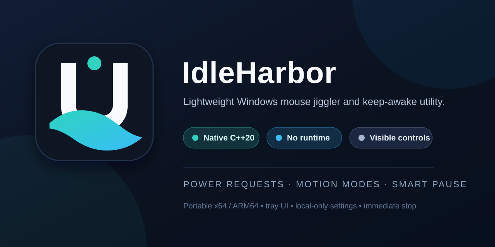
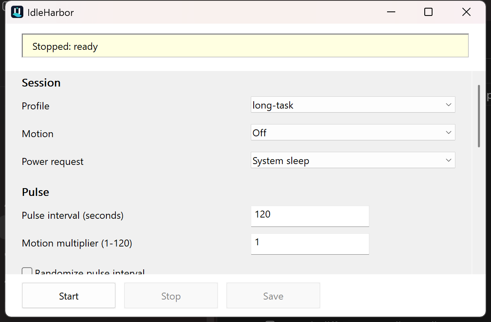
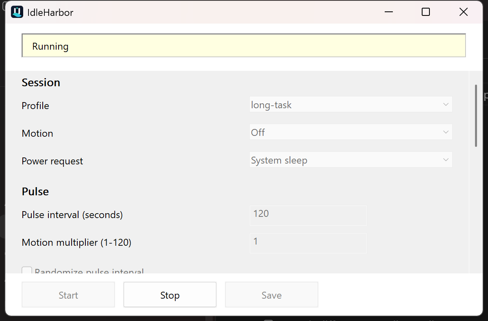
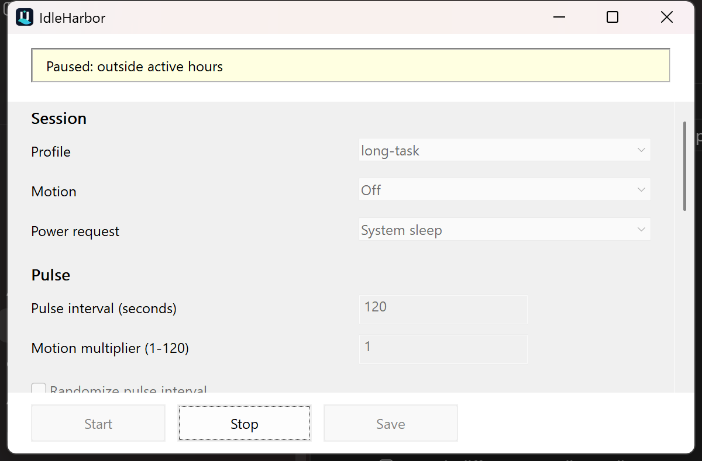
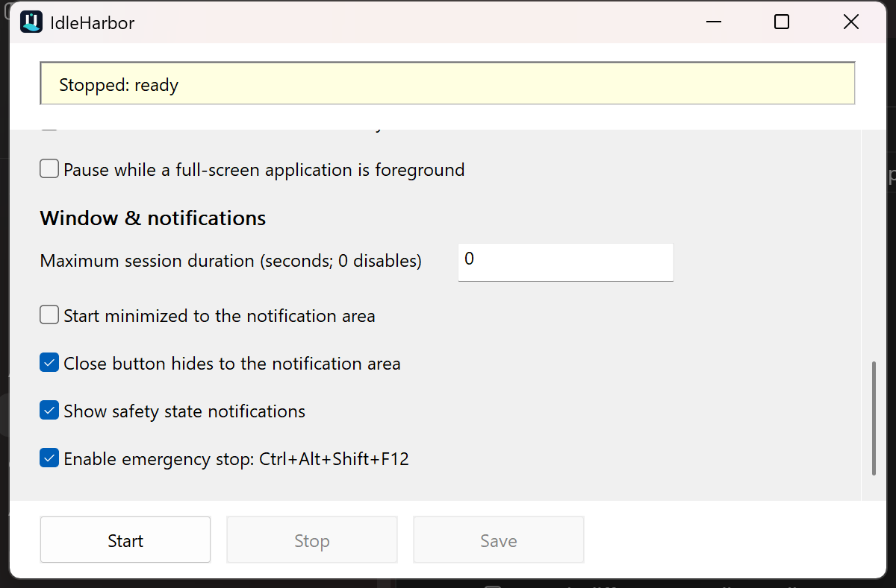
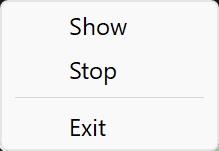

# IdleHarbor — Lightweight Windows Mouse Jiggler and Keep-Awake Utility

> A small, native Windows mouse jiggler and keep-awake utility for authorized work sessions,
> presentations, installations, and long-running local tasks.

[](https://github.com/Chris0Jeky/IdleHarbor/actions/workflows/ci.yml)
[](https://github.com/Chris0Jeky/IdleHarbor/actions/workflows/codeql.yml)
[](LICENSE)



## Genuine UI

<p align="center">
  
</p>

This is a real x64 Release-QA capture at 200% Windows display scaling, not a mock-up.

| Running | Intelligently paused |
| --- | --- |
|  |  |

<p align="center">
  
</p>

The scrolled safeguards view shows the same native window and its fixed action footer. Wheel,
scrollbar, resize, and keyboard-focus paths keep every control reachable without stale pixels.

<p align="center">
  
</p>

The repository includes a deterministic capture tool and a hash/dimension manifest for all five
images in [`docs/assets/capture-manifest.json`](docs/assets/capture-manifest.json).

IdleHarbor is an open-source, lightweight alternative to bulky mouse-jiggler applications. It is an
independent C++20/Win32 utility with no separately installed application runtime: optional motion
input and Windows power requests can be configured independently, while visible controls,
conservative safeguards, and an immediate stop path keep the session understandable and user
controlled. It does not provide concealment, monitoring bypasses, or claims of undetectability.

## Status

Version `0.1.0` is prepared for the first stable tag. When the tag workflow succeeds, the canonical
release page is [`v0.1.0`](https://github.com/Chris0Jeky/IdleHarbor/releases/tag/v0.1.0). If that page
is unavailable, no verified release artifact has been published yet. The visible runtime, policy
core, settings store, CLI, portable packaging scripts, per-user installer, startup choices, CI,
CodeQL, SBOM, and attestation workflow are implemented.

| Area | Available now | Notes |
| --- | --- | --- |
| Runtime | Native Win32 window and notification-area controls | Windows-only |
| Modes | Off, Normal, Zen, Circle, Linear | Behavior remains subject to application and Windows compatibility |
| Safeguards | Genuine-input pause, lock/disconnect, battery, fullscreen, active hours, max duration | Users must verify behavior in their own session |
| Configuration | Validated local INI settings and profiles | No cloud sync or telemetry |
| Distribution | Architecture-labelled portable archives and an optional per-user installer | [Canonical `v0.1.0` page once published](https://github.com/Chris0Jeky/IdleHarbor/releases/tag/v0.1.0) |
| Trust evidence | GPL-3.0-only, CI, CodeQL, SHA-256, SPDX SBOM, and GitHub attestations | `v0.1.0` is unsigned |

Read [`PROJECT_STATE.md`](PROJECT_STATE.md) for the current milestone and proving commands.

## Why IdleHarbor?

- **Native footprint:** C++20 and Windows system libraries, without bundling an application runtime.
- **Visible by design:** the window, tray state, status reason, settings, and stop controls remain
  available to the user.
- **Viewport-safe:** per-monitor DPI scaling, resize, native scrolling, and focus reveal keep every
  control reachable on compact or highly scaled displays.
- **Two complementary mechanisms:** motion modes address applications that observe input; power
  requests address Windows idle transitions. They can be configured independently.
- **Conservative automation:** the per-user Start Menu launcher is ownership-safe by default;
  automatic startup remains opt-in, least-privilege, and paired with an ownership-aware uninstall path.
- **Evidence-led delivery:** builds, tests, CodeQL, checksums, SBOMs, and attestations are part of
  the release workflow rather than marketing claims.

The local Visual Studio 2019 x64 Release-QA executable is 521,728 bytes (509.5 KiB) with SHA-256
`f39b280be248c84b6e625dcf5995673aee3949aea6a68967274554aabc0b62f2`. The reproducible three-run
resource baseline and its limitations are recorded in
[`docs/BENCHMARKS.md`](docs/BENCHMARKS.md).

## Build and test from source

Use a Windows developer PowerShell with Visual Studio 2019 or newer and CMake. This machine's
validated Visual Studio 2019 Build Tools command is:

```powershell
cmake -S . -B build/x64 -G "Visual Studio 16 2019" -A x64 -DIDLEHARBOR_BUILD_TESTS=ON
cmake --build build/x64 --config Release --parallel
ctest --test-dir build/x64 -C Release --output-on-failure
```

With Visual Studio 2022, use generator `Visual Studio 17 2022` instead.

The project is Windows-only. CI also builds ARM64 and Win32; release packaging currently produces
x64 and ARM64 archives. The packaging parser and ownership tests can be run independently:

```powershell
.\packaging\Test-Packaging.ps1
```

## Runtime at a glance

1. Launch IdleHarbor and confirm the visible state is **Stopped**.
2. Choose a profile or configure motion, power, and safeguard settings.
3. Press **Start** for the specific session that needs idle prevention.
4. Watch the status reason; genuine input, lock/session changes, battery policy, fullscreen policy,
   active hours, and maximum duration can pause or stop the session.
5. Press **Stop**, use the tray menu, or use the emergency hotkey when finished.

IdleHarbor stores local settings only. It has no network service or telemetry path.

## Modes and profiles

Motion modes are selectable independently of power requests:

| Motion | Behavior |
| --- | --- |
| Off | No pointer/input pulse; useful with a power request |
| Normal | Small visible diagonal path, scaled by the distance multiplier |
| Zen | Virtual mouse input intended not to move the visible pointer |
| Circle | Bounded circular path, scaled by the distance multiplier |
| Linear | Horizontal back-and-forth path, scaled by the distance multiplier |

The distance setting is a multiplier from **1** to **120**, not a raw pixel radius. Visible motion
uses independently designed IdleHarbor paths that remain bounded around a safe anchor and return
the cursor to its captured position. Project provenance is recorded in
[`THIRD-PARTY-NOTICES.md`](THIRD-PARTY-NOTICES.md).

Profiles provide named starting points and can be refined before saving:

| Profile | Starting point |
| --- | --- |
| Balanced | Zen input, system power request, 60-second interval, user/lock/disconnect/low-battery safeguards |
| Long task | No motion, system power request, 120-second interval, four-hour maximum duration |
| Presentation | No motion, display-and-system power request, no pause on genuine input |
| Compatibility | Visible Normal input, no power request, 60-second interval |
| Visible | Circle input, no power request |
| Battery saver | Zen input, no power request, randomized 30–120-second interval, 30% low-battery threshold |
| Custom | Balanced starting values for explicit user overrides |

Power modes are `none`, `system`, and `display`. A power request is not input simulation: it asks
Windows to keep the system or display available while the session is active.

## Command line

The GUI executable accepts one command and validated options. `--help` and `--version` open visible
information dialogs; `--status` opens a visible status dialog rather than writing to a console.

```text
Commands: --start (-j, --jiggle), --stop, --toggle, --status,
          --show (--settings, -g), --exit

Profiles: --profile balanced|long-task|presentation|compatibility|visible|battery-saver|custom
Motion:   --motion off|zen|diagonal|linear|circle
Power:    --power none|system|display
Timing:   --interval DURATION, --random, --no-random, --pause-on-input DURATION,
          --stop-after DURATION
Safety:   --distance MULTIPLIER (1..120), --battery-threshold 0..100,
          --pause-on-fullscreen, --no-pause-on-fullscreen
Window:   --minimized, --close-to-tray, --no-close-to-tray
Storage:  --portable, --config PATH
```

Durations accept seconds by default or `s`, `m`, and `h` suffixes. Storage-path options apply when
the owning instance is launched; an already-running instance remains bound to its existing settings
path. Profile and settings overrides affect the current owner instance without silently changing the
INI file; use the visible **Save** action if those values should persist. The complete help text in
the shipped executable is authoritative.

## Advanced INI settings

The settings store is a local, validated INI-style file. Portable mode places it beside the
executable; normal mode uses the user's local application-data directory; `--config PATH` selects an
explicit file. Unknown keys are ignored and invalid values fall back conservatively.

Active-hours controls are intentionally advanced and use minutes from midnight:

```ini
active_hours_enabled=true
active_hours_start_minute=540
active_hours_end_minute=1080
```

An end earlier than the start represents an overnight window. The complete key names are documented
in [`docs/USER_GUIDE.md`](docs/USER_GUIDE.md).

## Download, install, and trust

After the tag workflow succeeds, download the architecture-labelled portable archives from the
[`v0.1.0` release page](https://github.com/Chris0Jeky/IdleHarbor/releases/tag/v0.1.0). Until that page
exists, build from source rather than using an unverified mirror. The workflow publishes these exact
asset names:

- [`IdleHarbor-0.1.0-windows-x64-portable.zip`](https://github.com/Chris0Jeky/IdleHarbor/releases/download/v0.1.0/IdleHarbor-0.1.0-windows-x64-portable.zip) for most Windows PCs;
- [`IdleHarbor-0.1.0-windows-arm64-portable.zip`](https://github.com/Chris0Jeky/IdleHarbor/releases/download/v0.1.0/IdleHarbor-0.1.0-windows-arm64-portable.zip) for Windows on Arm.

It also publishes:

- `SHA256SUMS.txt` checksum manifest;
- SPDX 2.3 SBOM JSON for each executable;
- GitHub artifact attestations;
- package manifest with source revision and architecture.

The optional per-user installer, Start Menu launcher, and startup helpers are documented in
[`packaging/README.md`](packaging/README.md). `v0.1.0` is explicitly unsigned, so Windows may show a
publisher warning. Use the published SHA-256 checksums, SPDX SBOMs, and GitHub attestations to verify
its artifacts. Startup is always an explicit choice and is not enabled by the portable archive alone.

The recommended archive workflow is deliberately simple:

1. Download the ZIP matching the PC architecture (`x64` for most PCs, `ARM64` for Windows on Arm).
2. Verify the ZIP against `SHA256SUMS.txt`, then extract it.
3. Run `IdleHarbor.exe` directly for portable use, or run `install.ps1 -Startup None` for a per-user
   Start Menu installation with no automatic startup.
4. If automatic startup is genuinely wanted and permitted, preview
   `install.ps1 -Startup TaskScheduler -WhatIf`, then run it without `-WhatIf`.

Portable use does not configure persistence. On a managed laptop, do not configure Task Scheduler,
the Startup folder, or the Run key unless policy permits both IdleHarbor and that persistence
mechanism. Do not disable or independently whitelist around endpoint protection to make it run.

## Frequently asked questions

### Is IdleHarbor a mouse jiggler?

Yes. It can send bounded, configurable input patterns for applications that legitimately need
input activity, or it can run with motion **Off** and use only a Windows power request. It is a
transparent utility, not an invisible or undetectable mouse jiggler.

### Will it stop Windows from sleeping?

The **System** and **Display** power modes request that Windows keep the selected power state
available while a session is active. Whether that request is honored can depend on Windows policy,
hardware, lock state, battery settings, or a managed-device policy. Motion and power are separate,
so neither mechanism should be treated as a universal sleep-prevention guarantee.

### Does it move the visible pointer?

That depends on the selected motion mode. **Normal**, **Circle**, and **Linear** are bounded visible
patterns; **Zen** requests virtual input intended not to move the visible pointer; **Off** emits no
motion. Applications can detect, block, log, or ignore simulated input.

### Does it need .NET, Electron, or another runtime?

No separately installed application runtime is required. IdleHarbor is a native C++20/Win32 Windows
program built against Windows system libraries. The release notes and benchmark evidence describe
the exact build and its measured footprint.

### How do I stop it immediately?

Use the visible **Stop** button, the notification-area menu, or the configured emergency hotkey.
The session also pauses or stops for safeguards such as genuine input, lock or disconnect, battery
policy, fullscreen policy, active hours, and maximum duration when enabled.

### Is it appropriate for a managed work laptop?

Only if the device, account, and workplace rules allow it. Read [`docs/SAFETY.md`](docs/SAFETY.md)
and obtain any required approval first. IdleHarbor does not bypass monitoring or make activity
claims on a user's behalf; installing it and configuring automatic startup may be separate policy
decisions.

### Is v0.1.0 code-signed?

No. `v0.1.0` is intentionally unsigned because no signing identity has been provided. Checksums,
an SPDX SBOM, and GitHub provenance attestations provide release evidence, but they do not remove
Windows' unsigned-publisher warning. Signing can be added in a later release.

### Which license does IdleHarbor use?

The source and release artifacts use the GNU General Public License version 3 only
([`GPL-3.0-only`](LICENSE)). The repository and portable archives include the complete license text.

## Safety boundary

IdleHarbor is not an employee-monitoring bypass and must not be used to misrepresent presence or
evade a device policy. Simulated input may be detected, blocked, logged, or ignored. Check the rules
for a managed device before installing or running it. See [`docs/SAFETY.md`](docs/SAFETY.md).

## Documentation

- [`docs/USER_GUIDE.md`](docs/USER_GUIDE.md) — controls, profiles, CLI, INI, and startup workflows.
- [`docs/ARCHITECTURE.md`](docs/ARCHITECTURE.md) — landed runtime boundaries and release flow.
- [`docs/SAFETY.md`](docs/SAFETY.md) — acceptable use, privacy, and trust assumptions.
- [`docs/TROUBLESHOOTING.md`](docs/TROUBLESHOOTING.md) — build, runtime, install, and verification diagnosis.
- [`docs/BENCHMARKS.md`](docs/BENCHMARKS.md) — reproducible footprint and idle-cost methodology.
- [`packaging/README.md`](packaging/README.md) — portable archives, installation, and startup choices.
- [`CONTRIBUTING.md`](CONTRIBUTING.md) — development and review expectations.
- [`SECURITY.md`](SECURITY.md) — private vulnerability reporting.
- [`CHANGELOG.md`](CHANGELOG.md) — versioned user-visible changes.
- [`THIRD-PARTY-NOTICES.md`](THIRD-PARTY-NOTICES.md) — implementation provenance and attribution.

## Licence

IdleHarbor is free software licensed under the
[GNU General Public License version 3 only](LICENSE) (`GPL-3.0-only`). Source distributions and
portable release archives include the complete licence text.
