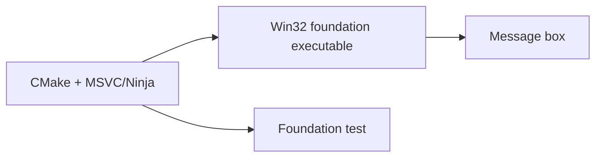
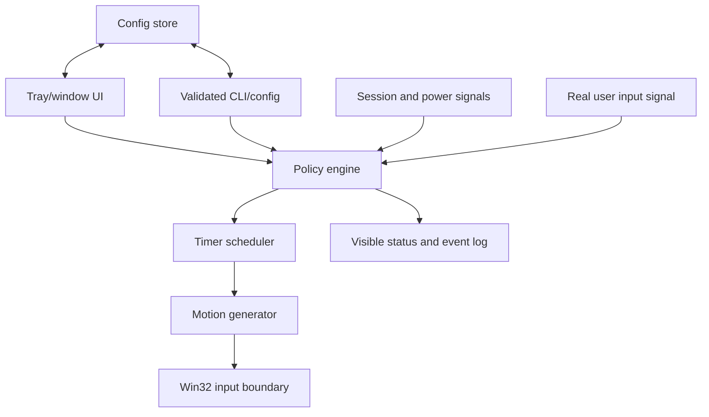
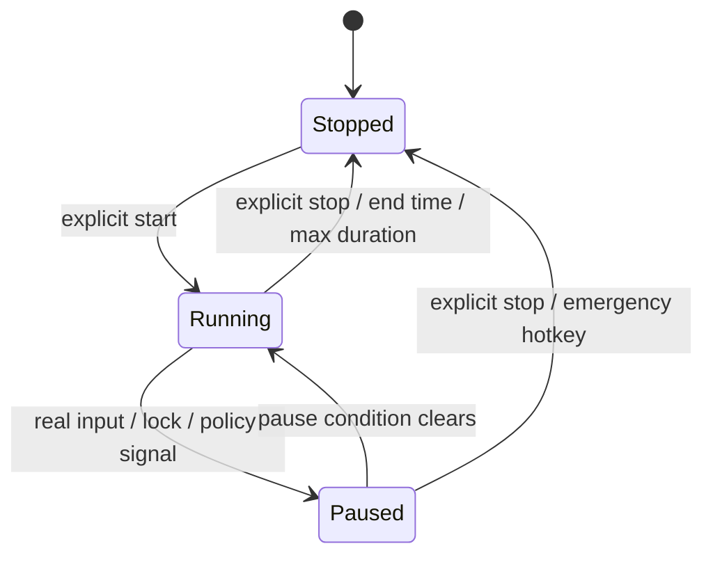

# Architecture

IdleHarbor is intentionally split around a small, testable policy core and a thin Windows shell.
The diagrams and component list below describe the v0.1.0 target unless marked **landed**.

## Current foundation

**Landed:** CMake configures a Windows-only C++20 project, builds a Unicode Win32 executable, and
registers one foundation test. The executable currently shows a message box and exits. No input,
timer, tray, scheduler, persistence, or network code has landed.

## Target v0.1.0 topology

### Components

- **Policy engine:** owns the state machine (`Stopped`, `Running`, and `Paused` with a reason),
  validates settings, and decides whether a tick is allowed. It must be testable without moving a
  real pointer.
- **Timer scheduler:** waits efficiently while stopped and schedules bounded work while running;
  it must not create a busy loop. Timer ownership and shutdown must be deterministic.
- **Motion generator:** produces Normal, Zen, Circle, and Linear intents from a monotonic clock and
  validated settings. It should be deterministic under a supplied test clock/seed.
- **Win32 input boundary:** the only component allowed to call the input API. The boundary remains
  observable and must expose failures to the policy/UI rather than silently retrying forever.
- **Session/power signals:** adapts lock, unlock, display/session change, battery/AC, and user
  activity signals into policy events.
- **UI and status:** presents the current state, pause reason, selected mode, and immediate stop
  control. Minimize-to-tray is a visibility choice, not concealment.
- **Configuration store:** persists only validated user settings. It must support reset-to-defaults
  and tolerate a missing, partial, or invalid file.

## State model

Every transition should have a visible reason. The emergency stop must be available without
navigating through settings.

## Boundaries and non-goals

The application is Windows-only, dependency-free outside Windows system libraries, and has no
planned network service or telemetry. It must not add elevation, process hiding, misleading names,
security-control evasion, or monitoring bypasses. Simulated input is a compatibility mechanism for
legitimate idle prevention, not an assertion of human presence.

## Testing strategy

1. Pure unit tests cover settings validation, interval randomization bounds, motion geometry, and
   state transitions with a fake clock and fake signals.
2. Windows integration tests cover session/power event translation and the input boundary without
   moving the user's pointer by default.
3. Opt-in smoke tests may exercise the visible application in an isolated test session.
4. Release checks build each supported architecture, run tests, record binary hashes, and retain
   provenance metadata.

## Release shape

The preferred artifact is one native executable per architecture, distributed in clearly labelled
portable archives. Package-manager or installer metadata may be added after the corresponding
artifact and uninstall path are verified. No download URL belongs in documentation until it exists.
