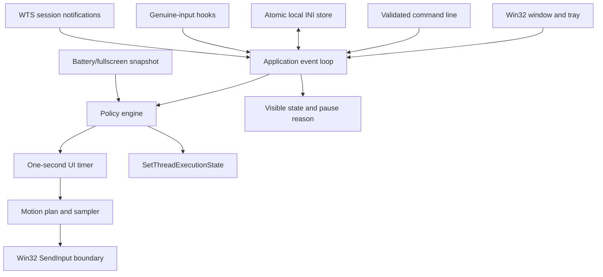
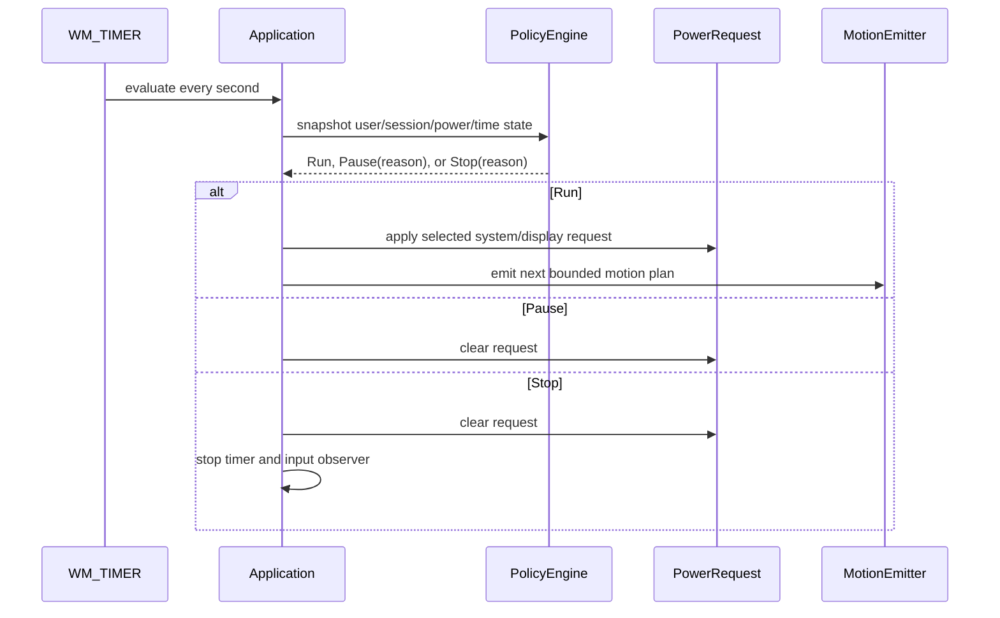

# Architecture

IdleHarbor is a native Windows executable with a platform-neutral policy core and explicit Win32
boundaries. The components described here are implemented unless marked as a release workflow or
verification activity.

## Runtime topology

## Landed layers

- **Core (`src/core`):** validates settings, supplies profiles, generates bounded motion plans and
  randomized intervals, and evaluates Running/Paused/Stopped policy decisions with reasons.
- **Application (`src/app`):** owns the visible per-monitor-DPI viewport, native control layout and
  scrolling, tray menu, single-instance mutex, command forwarding, settings load/save, timer, and
  clean shutdown.
- **Windows platform (`src/platform/windows`):** observes genuine input, emits marked motion input,
  queries battery/fullscreen/session context, and owns the power request.
- **Resources:** a per-monitor-DPI-aware manifest, native icon, and version metadata.

## Policy and timer flow

Genuine mouse and keyboard low-level hooks ignore IdleHarbor-marked injected input and post a
notification to the application thread. The policy engine then applies the configured quiet
cooldown. Lock/disconnect messages, battery/fullscreen snapshots, active hours, and maximum duration
are evaluated through the same policy boundary.

## Motion and power boundaries

Motion plans are generated as bounded relative paths and emitted through one Win32 input boundary.
Visible modes return to the captured cursor position; Zen emits a marked virtual move. Power modes
use `SetThreadExecutionState` and are cleared on pause, stop, shutdown, or object destruction. The
two mechanisms are intentionally independent so a user can select input, power, both, or neither
subject to settings validation.

## Configuration and command forwarding

Settings are loaded from a validated INI-style file and saved through a temporary file followed by
replacement. Portable and explicit config paths are resolved when the owning instance launches.

The application creates a local named mutex. A second invocation parses its own command line and
forwards supported commands through bounded `WM_COPYDATA` data to the visible owner window. The
payload is size-limited, wchar-aligned, NUL-terminated, parsed with `CommandLineToArgvW`, and freed
after handling. Storage paths remain an owner-instance concern.

## Visibility and lifecycle

The application starts visible by default, can minimize to the notification area, and exposes Show,
Start/Stop, and Exit from its tray menu. Close-to-tray is explicit. Shutdown handling stops an
active session; destruction unregisters the hotkey and session notifications, removes the tray icon,
stops the timer and hooks, and clears the power request.

The top-level window scales canonical control geometry for its current monitor, clamps its preferred
rectangle to the monitor work area, and keeps a fixed status/safety header and Start/Stop/Save action bar
outside a clipped settings viewport. When the body is taller than the available client area, that
viewport owns the native vertical scrollbar, so its track does not imply that the fixed header or
footer scrolls. Narrow work areas reflow paired labels and fields into one column and adapt the body
inset to the available width, while the action bar wraps or stacks. Child controls forward wheel input
to the viewport unless a combo list is open; partial wheel deltas are retained and Windows' configured
wheel-scroll amount is respected. Explicit dialog keyboard navigation sorts focus stops by their
visual layout, including the fixed footer's Start, Stop, Save order. It reveals a newly focused body control,
and also re-reveals the still-focused body control after resize/DPI layout changes; pointer and
scrollbar scrolling with unchanged focus remains stable.

Reveal is classified by how focus was reached. Each queued message is tagged as keyboard or pointer
input before it is dispatched, so a control clicked with the mouse is never scrolled out from under
the pointer; only keyboard focus moves and layout changes reveal. A suppressed reveal does not consume
the focus change, so driving that same control from the keyboard still reveals it.

A combo list is a popup anchored to a control the layout would otherwise move, so while one is open
the body does not scroll and its repaints are queued rather than forced: the same descendants are
invalidated and served by an ordinary `WM_PAINT` instead of a synchronous one. The list is a separate
top-level popup that `RDW_ALLCHILDREN` never reaches. Resize and DPI transactions
cannot be deferred that way, so they close any open list before repositioning. Only a list the user
can still close counts as open -- a hidden window or a combo disabled by a session start never freezes
the body. Combo selections are applied immediately when the list is already closed (keyboard and
forwarded changes) and otherwise queued and applied on `CBN_CLOSEUP`, so no `CB_SETCURSEL` or forced
repaint reaches a control that is still mid-gesture. Selecting the profile already in effect, which is
also what dismissing the list with Escape leaves selected, never reloads that profile's defaults over
edited settings.

Body controls all share the settings viewport as their parent and are repositioned in one
`BeginDeferWindowPos` batch; the status card and action buttons belong to the top-level window and are
positioned directly, because one deferred-position structure cannot mix parents.

Each field is followed by a `BodyControlKind::Hint` static: a short printed explanation in a
one-step-smaller font, never a tab stop. Its height is the height its own text wraps to, measured with
`DT_CALCRECT`, so it is not a constant. Hints keep a fixed `kHintWidth` rather than filling the body,
which makes the height reserved at creation exactly the height rendered at any window size and holds
the text to a readable line length; the stacked layout is narrower than that width and re-measures.

One shared tooltip control owns every control description. Tools are registered with
`TTF_IDISHWND | TTF_SUBCLASS` against the control handle, with the label and its field carrying the
same text. Static controls report themselves transparent to hit-testing, so the labels and the
owner-drawn status card take `SS_NOTIFY` to receive the hover; the dirty-state path is bounded to the
edit and check control IDs so the resulting `STN_CLICKED` (numerically `BN_CLICKED`) does not reach
it; `kFirstDirtyControl`/`kLastDirtyControl` and their static assertions bound that range, because an
edit or check added outside it would never mark the settings dirty. The wrap width is rescaled with
the rest of the UI on a DPI change. An active session disables the settings controls and Windows does
not deliver hover to a disabled control, so during a session only the labels, the status card, and
Stop still describe themselves.

No service, elevation, process hiding, network client, telemetry, or concealed startup path is part
of the design.

## Build, security, and release flow

CI builds x64, ARM64, and Win32 on Windows; runs tests for x64/Win32; validates PowerShell packaging
scripts; and uses pinned GitHub Actions. CodeQL performs a manual C/C++ build on pull requests,
main, and a weekly schedule. Stable SemVer tags trigger x64/ARM64 portable packaging, SPDX SBOM creation,
checksum generation, GitHub artifact attestations, and release publication.

The project is licensed `GPL-3.0-only`; the stable-tag workflow produces intentionally unsigned
archives with checksums, SPDX SBOMs, and GitHub artifact attestations for artifact identity and
provenance. No release is Authenticode-signed yet.
