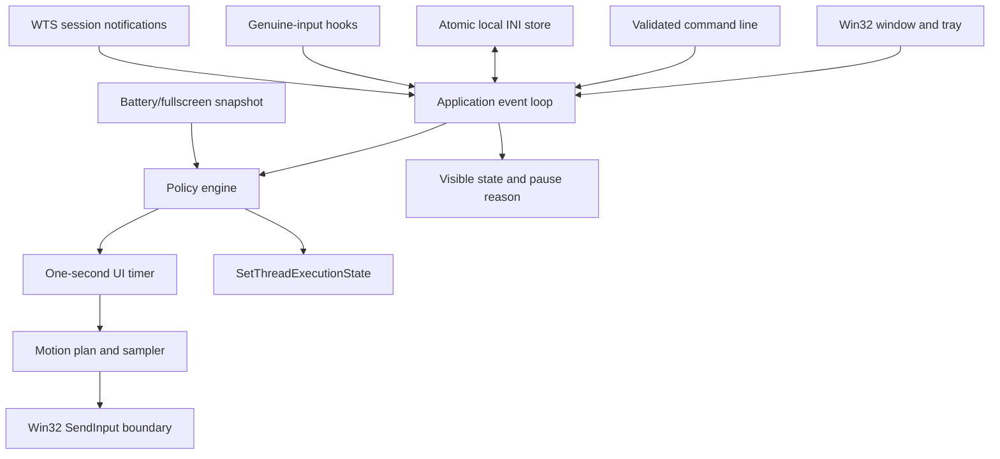
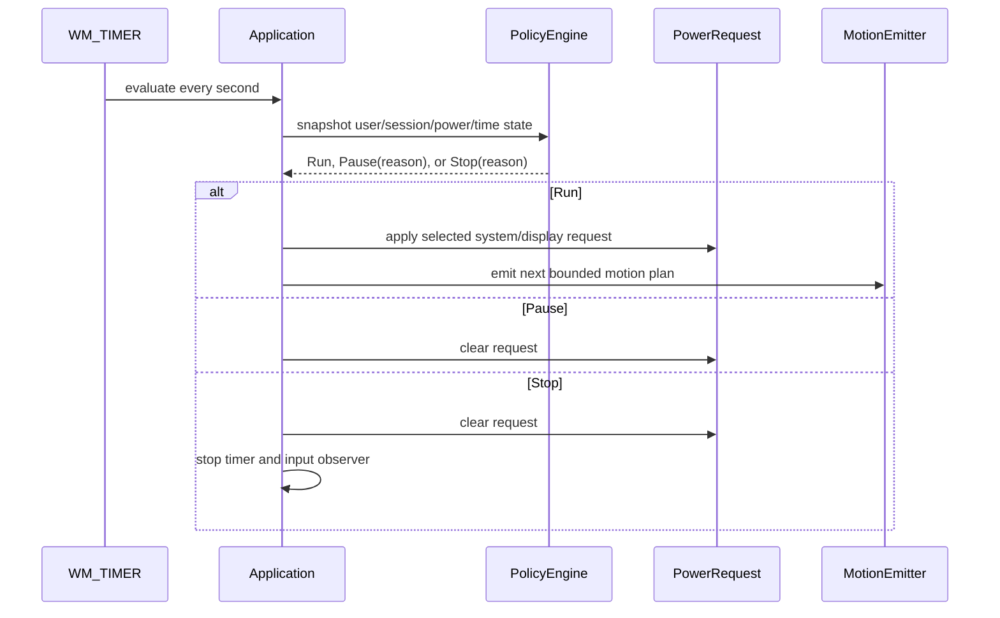

# Architecture

IdleHarbor is a native Windows executable with a platform-neutral policy core and explicit Win32
boundaries. The components described here are landed on the integration branch unless marked as a
release workflow or verification activity.

## Runtime topology

## Landed layers

- **Core (`src/core`):** validates settings, supplies profiles, generates bounded motion plans and
  randomized intervals, and evaluates Running/Paused/Stopped policy decisions with reasons.
- **Application (`src/app`):** owns the visible window, controls, tray menu, single-instance mutex,
  command forwarding, settings load/save, timer, and clean shutdown.
- **Windows platform (`src/platform/windows`):** observes genuine input, emits marked motion input,
  queries battery/fullscreen/session context, and owns the power request.
- **Resources:** a per-monitor-DPI-aware manifest, native icon, and version metadata.

## Policy and timer flow

Genuine mouse and keyboard low-level hooks ignore IdleHarbor-marked injected input and post a
notification to the application thread. The policy engine then applies the configured quiet
cooldown. Lock/disconnect messages, battery/fullscreen snapshots, active hours, and maximum duration
are evaluated through the same policy boundary.

## Motion and power boundaries

Motion plans are generated as bounded relative paths and emitted through one Win32 input boundary.
Visible modes return to the captured cursor position; Zen emits a marked virtual move. Power modes
use `SetThreadExecutionState` and are cleared on pause, stop, shutdown, or object destruction. The
two mechanisms are intentionally independent so a user can select input, power, both, or neither
subject to settings validation.

## Configuration and command forwarding

Settings are loaded from a validated INI-style file and saved through a temporary file followed by
replacement. Portable and explicit config paths are resolved when the owning instance launches.

The application creates a local named mutex. A second invocation parses its own command line and
forwards supported commands through bounded `WM_COPYDATA` data to the visible owner window. The
payload is size-limited, wchar-aligned, NUL-terminated, parsed with `CommandLineToArgvW`, and freed
after handling. Storage paths remain an owner-instance concern.

## Visibility and lifecycle

The application starts visible by default, can minimize to the notification area, and exposes Show,
Start/Stop, and Exit from its tray menu. Close-to-tray is explicit. Shutdown handling stops an
active session; destruction unregisters the hotkey and session notifications, removes the tray icon,
stops the timer and hooks, and clears the power request.

No service, elevation, process hiding, network client, telemetry, or concealed startup path is part
of the design.

## Build, security, and release flow

CI builds x64, ARM64, and Win32 on Windows; runs tests for x64/Win32; validates PowerShell packaging
scripts; and uses pinned GitHub Actions. CodeQL performs a manual C/C++ build on pull requests,
main, and a weekly schedule. Stable SemVer tags trigger x64/ARM64 portable packaging, SPDX SBOM creation,
checksum generation, GitHub artifact attestations, and release publication.

The workflow is configured, not evidence that a release has already been published. Authenticode
signing and the project licence remain explicit human decisions.
